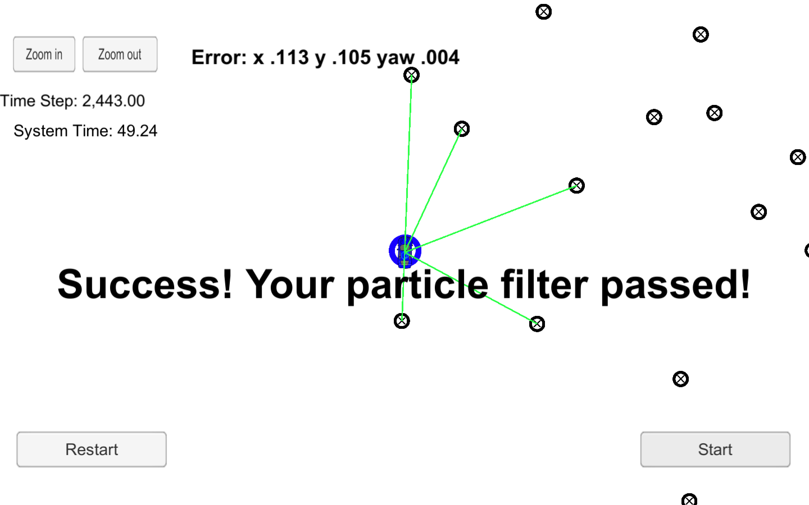
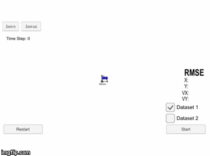

 # Kidnapped Car

In this project we try to find the location of a kidnapped vehicle using a particle filter, the particle filter does this by trying to match a set of given map landmarks where we'll be able to locate the car on the map using these landmarks. Basically a particle filter is a way for robots to locate themselves in the world around them, they observe the world around them via sensors readings then assosiate their sensor readings with map landmarks (particles) to see where they are not too different from us.

## Video

